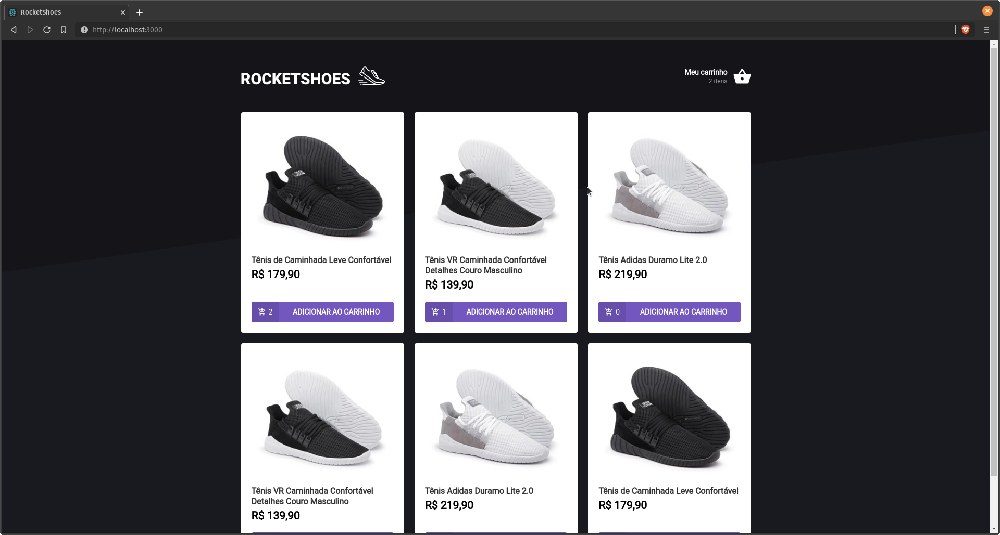
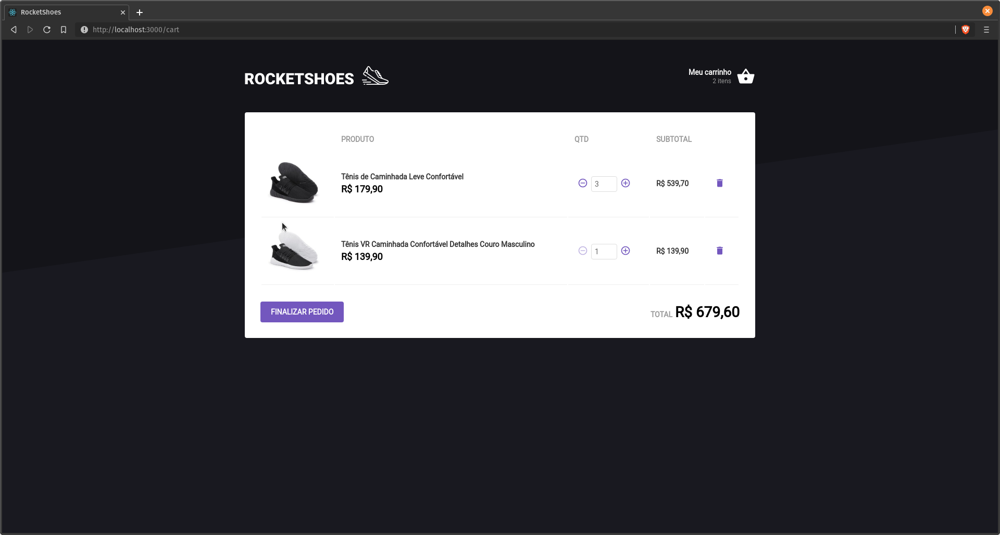

## A aplicação é um e-commerce de uma loja de sapatos 

### Principais tecnologias utilizadas no projeto: 

### Execute a aplicação na sua máquina:

#### Clone este repositório 
>`git clone https://github.com/flavicon/carrinho-de-compras-reactjs.git`

#### Acesse o diretório 
> `cd carrinho-de-compras-reactjs`

#### Baixe as dependências necessárias 
>`yarn`

#### Inicialize o json-server para termos acesso à API
>`yarn server`

#### Por fim inicialize a aplicação
>`yarn start`

